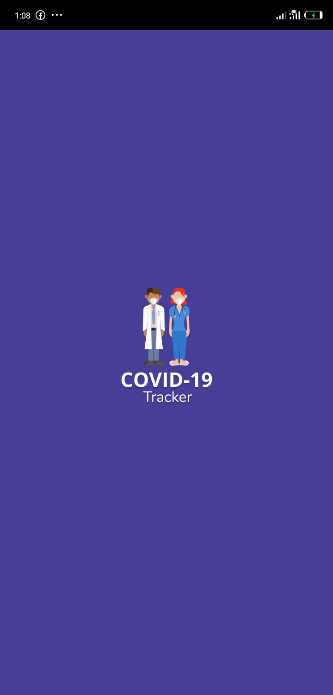
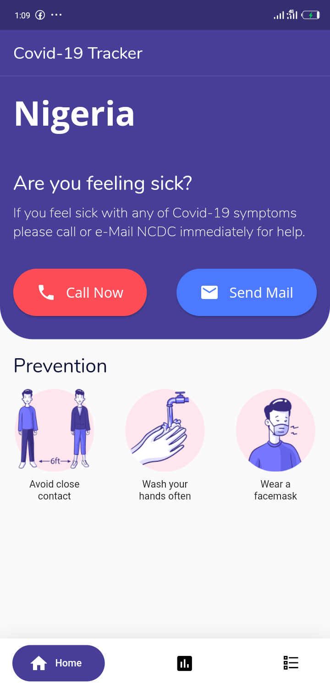
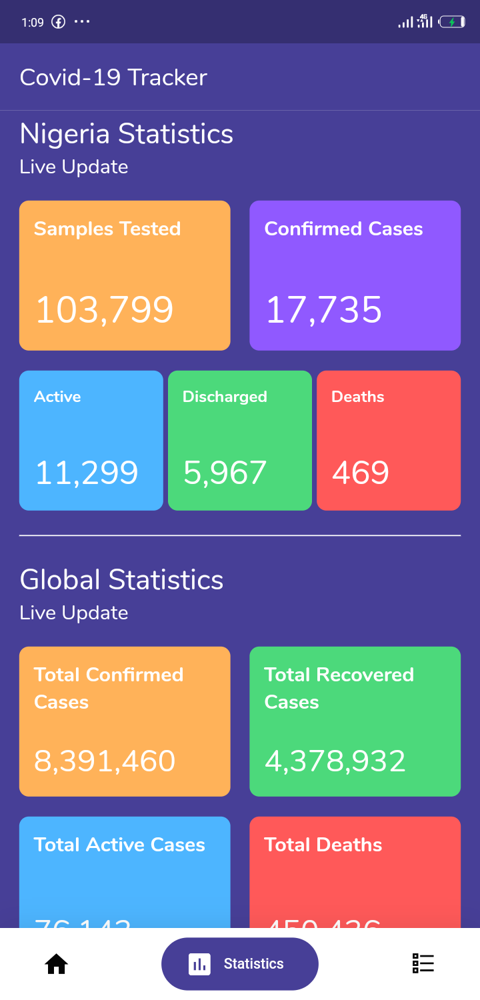
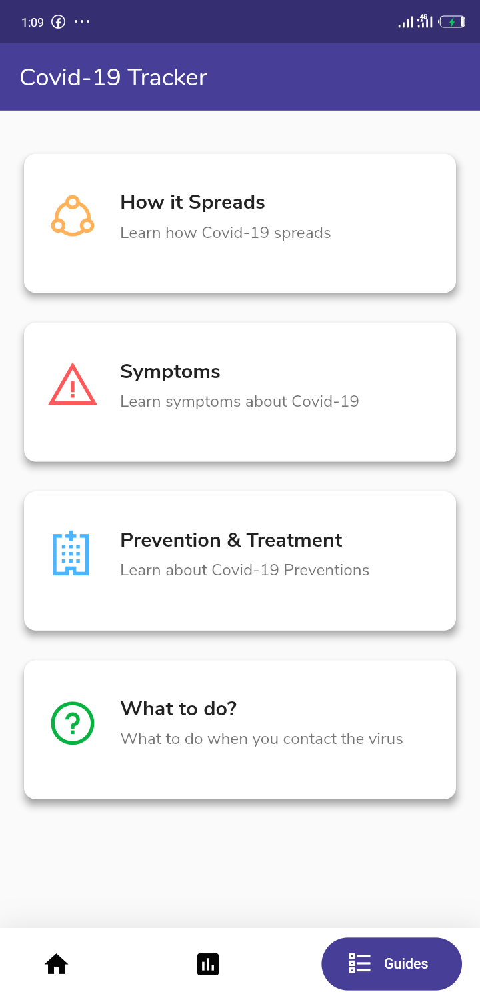

# :chart_with_upwards_trend:  COVID-19 TRACKER 
 

A simple COVID-19 Tracker App that displays Nigeria and Global Statistics on COVID-19 Cases. 

The [Virus Tracker API](https://thevirustracker.com/api) was used to provide the Global data while [COVID Nigeria API](https://covidnigeria.herokuapp.com/) was used to provide the Nigeria data. 

The [www.cdc.gov](https://www.cdc.gov) was used to provide the guides.

## :dizzy:  Features
- View all cases statistics.
- Read guides on COVID-19 Preventions and Symptoms.

## :camera:  Screenshots

&nbsp;

&nbsp;

_*UI Inspiration gotten from https://dribbble.com/shots/11015463-Covid-19-App-Free*_

## :electric_plug:  Plugins
| Name | Usage |
|:------:|:-------:|
|[**url_launcher**](https://pub.dev/packages/url_launcher)| URL Launcher|

## :sunglasses:  Author(s)
**Yusuf Ahmed Tijani** 

## :bookmark:  License
[Apache-2.0](https://github.com/iloveteajay/COVID_19-TRACKER-APP-/blob/master/LICENSE)

***
> Feel free to star ⭐ this repository if you like what you see 😉.
